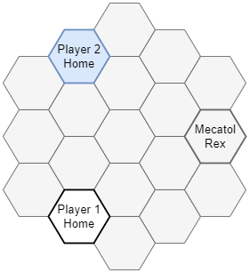
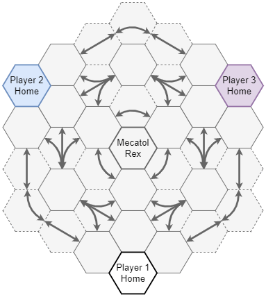
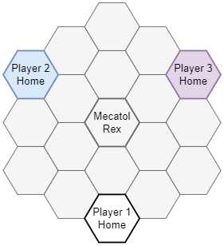
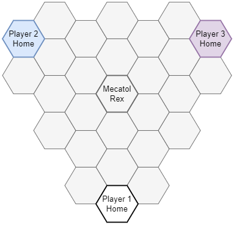
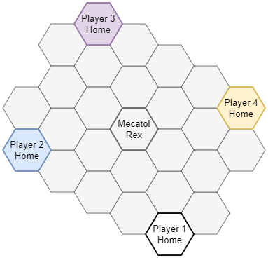
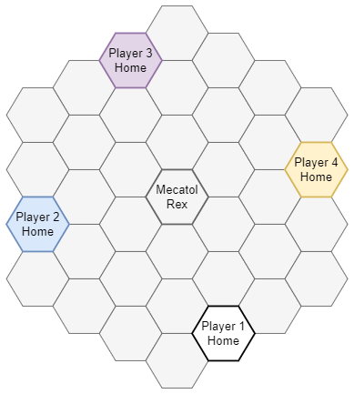
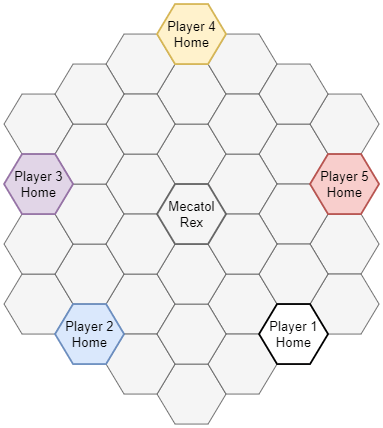
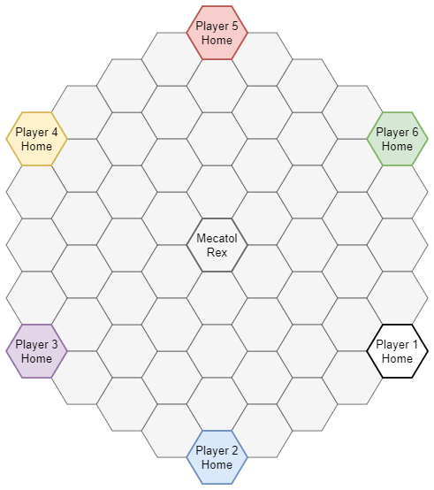
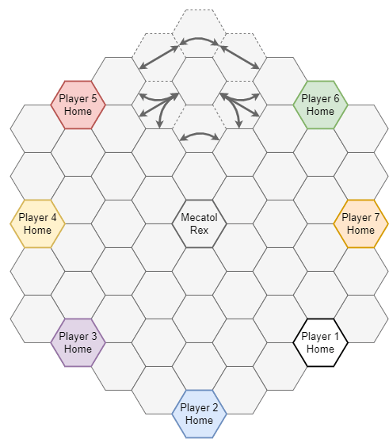
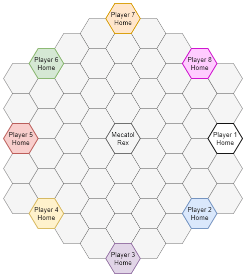

# TI4 Cartographer


Generates randomized balanced boards for the Twilight Imperium 4th Edition board game.

- [Setup](#setup)
- [Usage](#usage)
- [Board Layouts](#board-layouts)
- [Documentation](#documentation)
- [License](#license)

## Setup
The following packages are required:
- **C++17 Compiler:** Any C++17 compiler will do, such as GCC or Clang. On Ubuntu, install GCC with `sudo apt install g++` or Clang with `sudo apt install clang`.
- **CMake:** On Ubuntu, install with `sudo apt install cmake`.

Build the programs with:

```
mkdir build
cd build
cmake ..
make -j
```

This builds the main program, `build/bin/ti4cartographer`, as well as the `build/bin/ti4atlas` utility.
- `ti4cartographer` is the main program used to generate a randomized balanced board.
- `ti4atlas` is a small utility program that prints the various systems ranked from best to worst.

You can optionally run tests from the `build` directory with:

```
make test
```

You can optionally install the programs from the `build` directory with:

```
sudo make install
```

This installs the programs to `/usr/local/bin/ti4cartographer` and `/usr/local/bin/ti4atlas`. To uninstall a program, simply delete it.

[^ Back to Top](#ti4-cartographer)

## Usage
Run `ti4cartographer` with no arguments or with the `--help` argument to obtain usage information. Otherwise, for regular use, run `ti4cartographer` with:

```
ti4cartographer  --players <number>  --layout <type>  --aggression <type>  --version <type>  --quiet
```

- `--players <number>`: Required. Specifies the number of players. Choices are `2`, `3`, `4`, `5`, `6`, `7`, or `8`.
- `--layout <type>`: Optional. Specifies the board layout. Choices vary by number of players, but typically include `regular`, `small`, or `large`; see the [Board Layouts](#board-layouts) section. The default is `regular`.
- `--aggression <type>`: Optional. Specifies the degree of expected aggression resulting from the placement of systems on the board. Choices are `low`, `moderate`, or `high`. The default is `moderate`. Higher aggression places better systems at equidistant positions compared to the systems in each player's slice, whereas lower aggression does the opposite.
- `--version <type>`: Optional. Determines whether the system tiles from the Prophecy of Kings expansion can be used. Choices are `base` or `expansion`. The default is `expansion`. Note that 7 and 8 player games require the Prophecy of Kings expansion.
- `--quiet`: Optional. Activates quiet mode, where the only console output is the generated board's Tabletop Simulator string.

The `ti4cartographer` program computes an optimal board given the arguments and outputs its Tabletop Simulator string as well as a link to visualize the board in Keegan Williams' TI4 Map Generator (<https://keeganw.github.io/ti4/>).

The `ti4atlas` utility takes no arguments and simply prints out a list of the various systems ranked from best to worst. This ranking only takes into account the individual systems by themselves, and does not account for position on the game board, suitability as a forward outpost, or other interactions; such considerations are handled by the `ti4cartographer` program.

[^ Back to Top](#ti4-cartographer)

## Board Layouts
- [2 Players Regular](#board-layout-2-players-regular)
- [3 Players Regular](#board-layout-3-players-regular)
- [3 Players Small](#board-layout-3-players-small)
- [3 Players Large](#board-layout-3-players-large)
- [4 Players Regular](#board-layout-4-players-regular)
- [4 Players Small](#board-layout-4-players-small)
- [4 Players Large](#board-layout-4-players-large)
- [5 Players Regular](#board-layout-5-players-regular)
- [5 Players Small](#board-layout-5-players-small)
- [5 Players Large](#board-layout-5-players-large)
- [6 Players Regular](#board-layout-6-players-regular)
- [6 Players Large](#board-layout-6-players-large)
- [7 Players Regular](#board-layout-7-players-regular)
- [7 Players Small](#board-layout-7-players-small)
- [7 Players Large](#board-layout-7-players-large)
- [8 Players Regular](#board-layout-8-players-regular)
- [8 Players Small](#board-layout-8-players-small)
- [8 Players Large](#board-layout-8-players-large)

[^ Back to Top](#ti4-cartographer)

### Board Layout: 2 Players Regular
5 planetary systems and 3 anomaly/wormhole/empty systems per player.

```
ti4cartographer --players 2 --layout regular
```



[^ Back to Board Layouts](#board-layouts)

### Board Layout: 3 Players Regular
3 planetary systems and 2 anomaly/wormhole/empty systems per player. Uses hyperlanes. Requires the Prophecy of Kings Expansion.

```
ti4cartographer --players 3 --layout regular
```



[^ Back to Board Layouts](#board-layouts)

### Board Layout: 3 Players Small
3 planetary systems and 2 anomaly/wormhole/empty systems per player.

```
ti4cartographer --players 3 --layout small
```



[^ Back to Board Layouts](#board-layouts)

### Board Layout: 3 Players Large
5 planetary systems and 3 anomaly/wormhole/empty systems per player.

```
ti4cartographer --players 3 --layout large
```



[^ Back to Board Layouts](#board-layouts)

### Board Layout: 4 Players Regular
3 planetary systems and 2 anomaly/wormhole/empty systems per player. Uses hyperlanes. Requires the Prophecy of Kings Expansion.

```
ti4cartographer --players 4 --layout regular
```


[^ Back to Board Layouts](#board-layouts)

### Board Layout: 4 Players Small
3 planetary systems and 2 anomaly/wormhole/empty systems per player, with 1 additional planetary system and 1 additional anomaly/wormhole/empty system.

```
ti4cartographer --players 4 --layout small
```



[^ Back to Board Layouts](#board-layouts)

### Board Layout: 4 Players Large
5 planetary systems and 3 anomaly/wormhole/empty systems per player.

```
ti4cartographer --players 4 --layout large
```



[^ Back to Board Layouts](#board-layouts)

### Board Layout: 5 Players Regular
3 planetary systems and 2 anomaly/wormhole/empty systems per player. Uses hyperlanes. Requires the Prophecy of Kings Expansion.

```
ti4cartographer --players 5 --layout regular
```


[^ Back to Board Layouts](#board-layouts)

### Board Layout: 5 Players Small
3 planetary systems and 2 anomaly/wormhole/empty systems per player.

```
ti4cartographer --players 5 --layout small
```


[^ Back to Board Layouts](#board-layouts)

### Board Layout: 5 Players Large
4 planetary systems and 2 anomaly/wormhole/empty systems per player, with 1 additional anomaly/wormhole/empty system.

```
ti4cartographer --players 5 --layout large
```



[^ Back to Board Layouts](#board-layouts)

### Board Layout: 6 Players Regular
3 planetary systems and 2 anomaly/wormhole/empty systems per player.

```
ti4cartographer --players 6 --layout regular
```


[^ Back to Board Layouts](#board-layouts)

### Board Layout: 6 Players Large
6 planetary systems and 3 anomaly/wormhole/empty systems per player. Requires the Prophecy of Kings Expansion.

```
ti4cartographer --players 6 --layout large
```



[^ Back to Board Layouts](#board-layouts)

### Board Layout: 7 Players Regular
3 planetary systems and 2 anomaly/wormhole/empty systems per player. Uses hyperlanes. Requires the Prophecy of Kings Expansion.

```
ti4cartographer --players 7 --layout regular
```


[^ Back to Board Layouts](#board-layouts)

### Board Layout: 7 Players Small
4 planetary systems and 2 anomaly/wormhole/empty systems per player, with 1 additional planetary system and 1 additional anomaly/wormhole/empty system. Requires the Prophecy of Kings Expansion.

```
ti4cartographer --players 7 --layout small
```


[^ Back to Board Layouts](#board-layouts)

### Board Layout: 7 Players Large
4 planetary systems and 2 anomaly/wormhole/empty systems per player, with 3 additional planetary systems and 2 additional anomaly/wormhole/empty systems. Uses hyperlanes. Requires the Prophecy of Kings Expansion.

```
ti4cartographer --players 7 --layout large
```



[^ Back to Board Layouts](#board-layouts)

### Board Layout: 8 Players Regular
3 planetary systems and 2 anomaly/wormhole/empty systems per player. Uses hyperlanes. Requires the Prophecy of Kings Expansion.

```
ti4cartographer --players 8 --layout regular
```


[^ Back to Board Layouts](#board-layouts)

### Board Layout: 8 Players Small
4 planetary systems and 2 anomaly/wormhole/empty systems per player. Requires the Prophecy of Kings Expansion.

```
ti4cartographer --players 8 --layout small
```


[^ Back to Board Layouts](#board-layouts)

### Board Layout: 8 Players Large
4 planetary systems and 2 anomaly/wormhole/empty systems per player, with 2 additional planetary systems and 2 additional anomaly/wormhole/empty systems. Requires the Prophecy of Kings Expansion.

```
ti4cartographer --players 8 --layout large
```



[^ Back to Board Layouts](#board-layouts)

## Documentation
Building the documentation is optional and requires additional packages:
- **Doxygen:** On Ubuntu, install with `sudo apt install doxygen`.
- **Graphviz:** On Ubuntu, install with `sudo apt install graphviz`.
- **TeX Live:** On Ubuntu, install with `sudo apt install texlive texlive-fonts-extra`.

Documentation is disabled by default but can be generated from the `build` directory with:

```
cmake .. -DBUILD_DOCS=ON
make docs
```

This generates HTML documentation using Doxygen. The documentation is located in `docs/html`. Open the `docs/html/index.html` file in any web browser to view the documentation.

[^ Back to Top](#ti4-cartographer)

## License
This work is maintained by Alexandre Coderre-Chabot (<https://github.com/acodcha>) and licensed under the MIT License. For more details, see the [LICENSE](LICENSE) file or <https://mit-license.org/>. This work is based on the Twilight Imperium 4th Edition board game by Fantasy Flight Games. The contents, copyrights, and trademarks of everything involving Twilight Imperium 4th Edition are exclusively held by Fantasy Flight Games; I make no claim to any of these in any way.

[^ Back to Top](#ti4-cartographer)
