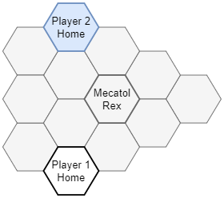
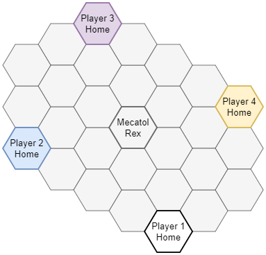
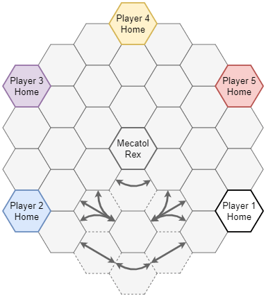
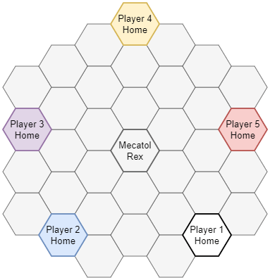
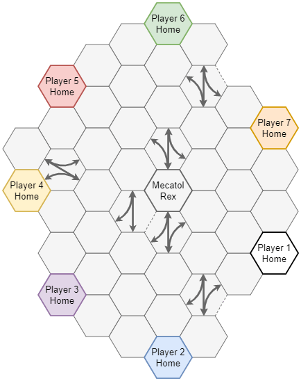
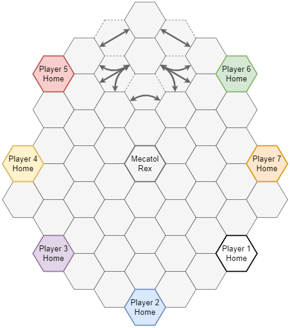
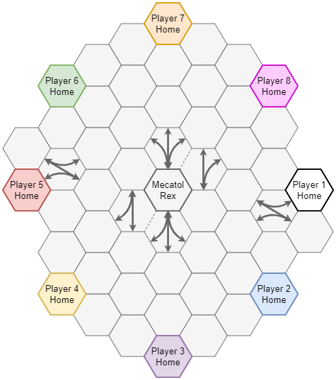
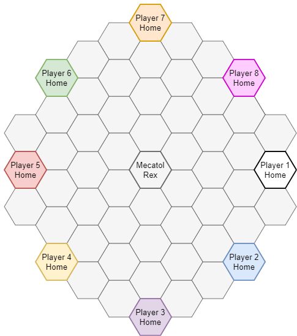

# TI4 Cartographer


Generates randomized balanced boards for the Twilight Imperium 4th Edition board game.

- [Setup](#setup)
- [Documentation](#documentation)
- [Usage](#usage)
- [Board Layouts](#board-layouts)
- [License](#license)
- [Maintainer](#maintainer)

## Setup
The following packages are required:
- **C++17 Compiler:** Any C++17 compiler will do, such as GCC or Clang. On Ubuntu, install GCC with `sudo apt install g++` or Clang with `sudo apt install clang`.
- **CMake:** On Ubuntu, install with `sudo apt install cmake`.

Build the programs with:

```
mkdir build
cd build
cmake ..
make -j
```

This builds the main program, `build/bin/ti4cartographer`, as well as the `build/bin/ti4atlas` utility.
- `ti4cartographer` is the main program used to generate a randomized balanced board.
- `ti4atlas` is a small utility program that prints the various systems ranked from best to worst.

You can optionally run tests from the `build` directory with:

```
make test
```

You can optionally install the programs from the `build` directory with:

```
sudo make install
```

This installs the programs to `/usr/local/bin/ti4cartographer` and `/usr/local/bin/ti4atlas`. To uninstall the program, simply delete it.

[^ Back to Top](#ti4-cartographer)

## Documentation
Building the documentation is optional and requires additional packages:
- **Doxygen:** On Ubuntu, install with `sudo apt install doxygen`.
- **Graphviz:** On Ubuntu, install with `sudo apt install graphviz`.
- **TeX Live:** On Ubuntu, install with `sudo apt install texlive texlive-fonts-extra`.

Documentation is disabled by default but can be generated from the `build` directory with:

```
cmake .. -DBUILD_DOCS=ON
make docs
```

This generates HTML documentation using Doxygen. The documentation is located in `docs/html`. Open the `docs/html/index.html` file in any web browser to view the documentation.

[^ Back to Top](#ti4-cartographer)

## Usage
Run `ti4cartographer` with no arguments or with the `--help` argument to obtain usage information.

Otherwise, for regular use, run with:

```
ti4cartographer --players <number> [--version <type>] [--layout <type>] [--aggression <amount>]
```

- `--players <number>`: Required. Choices are `2`, `3`, `4`, `5`, `6`, `7`, or `8`. Specifies the number of players.
- `--version <type>`: Optional. Choices are `base` or `expansion`. The default is `expansion`. Determines whether the system tiles from the Prophecy of Kings expansion can be used. Note that 7 and 8 player games require the expansion.
- `--layout <type>`: Optional. Choices vary by number of players; see the [Board Layouts](#board-layouts) section. Specifies the board layout. Boards for 4, 5, 7, and 8 players have multiple board layout options. By default, the regular layout for the given number of players is used. Boards for 2, 3, and 6 players do not have any layout options.
- `--aggression <amount>`: Optional. Choices are `very-high`, `high`, `medium`, `low`, or `very-low`. Specifies the degree of expected aggression resulting from the placement of systems on the board. By default, `medium` is used. Higher aggression places better systems at equidistant positions compared to the systems in each player's slice, whereas lower aggression does the opposite.

[^ Back to Top](#ti4-cartographer)

## Board Layouts
- [2 Players](#board-layout-2-players)
- [3 Players](#board-layout-3-players)
- [4 Players Regular](#board-layout-4-players-regular)
- [4 Players Large](#board-layout-4-players-large)
- [5 Players Regular](#board-layout-5-players-regular)
- [5 Players Small](#board-layout-5-players-small)
- [5 Players Large](#board-layout-5-players-large)
- [6 Players](#board-layout-6-players)
- [7 Players Regular](#board-layout-7-players-regular)
- [7 Players Large](#board-layout-7-players-large)
- [8 Players Regular](#board-layout-8-players-regular)
- [8 Players Large](#board-layout-8-players-large)

[^ Back to Top](#ti4-cartographer)

### Board Layout: 2 Players
3 planetary systems and 2 anomaly/wormhole/empty systems per player.

```
ti4cartographer --players 2
```



[^ Back to Board Layouts](#board-layouts)

### Board Layout: 3 Players
3 planetary systems and 2 anomaly/wormhole/empty systems per player.

```
ti4cartographer --players 3
```


[^ Back to Board Layouts](#board-layouts)

### Board Layout: 4 Players Regular
3 planetary systems and 2 anomaly/wormhole/empty systems per player. Uses hyperlanes.

```
ti4cartographer --players 4 --layout regular
```


[^ Back to Board Layouts](#board-layouts)

### Board Layout: 4 Players Large
3 planetary systems and 3 anomaly/wormhole/empty systems per player.

```
ti4cartographer --players 4 --layout large
```



[^ Back to Board Layouts](#board-layouts)

### Board Layout: 5 Players Regular
3 planetary systems and 2 anomaly/wormhole/empty systems per player. Uses hyperlanes.

```
ti4cartographer --players 5 --layout regular
```



[^ Back to Board Layouts](#board-layouts)

### Board Layout: 5 Players Small
3 planetary systems and 2 anomaly/wormhole/empty systems per player.

```
ti4cartographer --players 5 --layout small
```


[^ Back to Board Layouts](#board-layouts)

### Board Layout: 5 Players Large
3 planetary systems and 3 anomaly/wormhole/empty systems per player.

```
ti4cartographer --players 5 --layout large
```



[^ Back to Board Layouts](#board-layouts)

### Board Layout: 6 Players
3 planetary systems and 2 anomaly/wormhole/empty systems per player.

```
ti4cartographer --players 6
```


[^ Back to Board Layouts](#board-layouts)

### Board Layout: 7 Players Regular
3 planetary systems and 2 anomaly/wormhole/empty systems per player. Uses hyperlanes.

```
ti4cartographer --players 7 --layout regular
```



[^ Back to Board Layouts](#board-layouts)

### Board Layout: 7 Players Large
4 planetary systems and 2 anomaly/wormhole/empty systems per player. Uses hyperlanes.

```
ti4cartographer --players 7 --layout large
```



[^ Back to Board Layouts](#board-layouts)

### Board Layout: 8 Players Regular
3 planetary systems and 2 anomaly/wormhole/empty systems per player. Uses hyperlanes.

```
ti4cartographer --players 8 --layout regular
```



[^ Back to Board Layouts](#board-layouts)

### Board Layout: 8 Players Large
4 planetary systems and 2 anomaly/wormhole/empty systems per player. Uses hyperlanes.

```
ti4cartographer --players 8 --layout large
```



[^ Back to Board Layouts](#board-layouts)

## License
This work is licensed under the MIT License. For more details, see the [LICENSE](LICENSE) file or <https://mit-license.org/>.

[^ Back to Top](#ti4-cartographer)

## Maintainer
- Alexandre Coderre-Chabot (<https://github.com/acodcha>)

[^ Back to Top](#ti4-cartographer)
